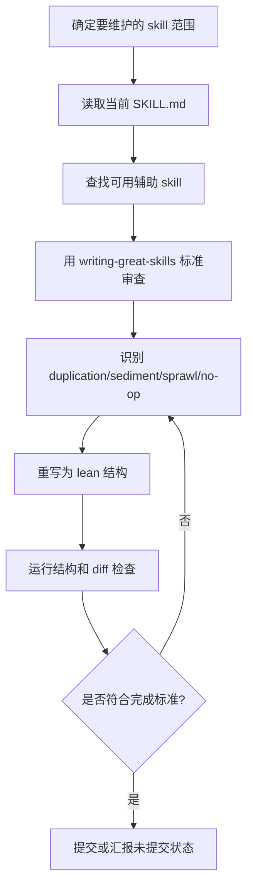

# Skill Maintenance — 项目级技能规范化

## 边界

- 只改 `.claude/skills/**/SKILL.md` 及必要的同级参考文件；不改应用代码、CI 逻辑或业务文档。
- skill 的目标是**可预测执行**，不是写长手册；每条规则必须改变 agent 行为。
- 项目事实 / SOP 优先落在项目 Git；用户偏好才进 memory。
- 借鉴 lean prompt 原则：指令只写一次、删重复、保留成功标准和关键 caveat。

## 流程



## 必跑步骤

### 1. 选择范围

```bash
find <project>/.claude/skills -path '*/SKILL.md' -print
```

先确认用户要改的是：单个 skill、同类 skill、还是把流程沉淀为根目录项目级 skill。

### 2. 读取规范来源

优先使用这些辅助：

- `writing-great-skills`：skill 规范性标准，重点看 predictability、single source of truth、pruning、failure modes。
- `code-simplifier` / `ponytail`：找重复、过期示例、可删段落。
- 外部 prompt 指南仅作为参考；落地时以项目约束和可验证完成标准为准。

### 3. Lean 结构模板

优先写成：

```text
frontmatter
# Skill Name

## 边界
## 流程（mermaid flowchart TD）
## 必跑步骤
## 失败诊断不变量 / Red Flags
## 完成标准 / 相关文件
```

按需保留项目专项检查；不要保留示例对话、长背景、重复版本规则、过期命令输出。

### 4. Pruning 检查

逐段判断：

| 问题 | 处理 |
| --- | --- |
| 同一意思出现两次 | 保留最靠近执行点的一处 |
| 背景叙事不影响动作 | 删除 |
| 示例会随版本过期 | 改成模板或删掉 |
| 命令和规则冲突 | 以更可验证、更近期的规则为准 |
| 只有“不要做 X” | 改成“做 Y；X 仅作为 hard guardrail” |
| 大段 reference 只在少数分支用 | 下沉到同级参考文件，并在主 skill 放 context pointer |

### 5. Flowchart 要求

- 用 `mermaid` + `flowchart TD`。
- 图只放结构、状态、决策和回环；不要塞日志、命令、长解释。
- 图里的每个终点都要能映射到“成功 / 失败诊断 / 汇报”。

### 6. 完成标准

必须全部满足：

```bash
# 格式检查
git diff --check -- <skill files>

# 结构检查（按需脚本化）
# - 有 frontmatter
# - description 是触发条件，不是流程正文
# - 恰好一个主要 mermaid flowchart TD
# - 无 TODO、示例沉积、过期轮询文案
# - 行数合理；频繁触发 skill 通常应 < 180 行
```

语义标准：

- 触发边界清楚：什么时候用、什么时候不用。
- 每个步骤有可检查完成条件。
- 失败诊断要求引用原始证据，不允许只凭猜测。
- Public surface / destructive 操作有确认或交给用户执行的边界。
- 项目专项风险保留为不变量，不被“精简”删掉。

## Red Flags

- “先把所有细节都写进去保险”——会造成 sprawl 和 context load。
- “示例对话有帮助，留着吧”——多数会过期；保留命令模板即可。
- “description 写完整流程”——错，description 只负责触发。
- “只要短就好”——错；不能删成功标准、失败证据要求、项目 hard guardrail。
- “外部指南说精简，所以删项目特例”——错；项目不变量优先。

## 汇报模板

```text
已优化 <N> 个 skill：
- <path>: <主要结构变化>
- <path>: <主要结构变化>
验证：git diff --check 通过；结构检查通过。
未提交/已提交：<commit or status>。
```
