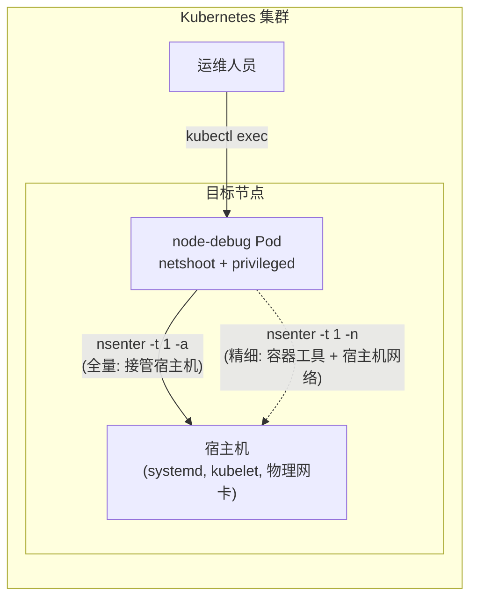

# Node Debug

通过特权 DaemonSet + `nsenter` 实现 Kubernetes 节点的**无 SSH 应急救援**。节点网络隔离或 SSH 不可用时，`kubectl exec` 进入调试 Pod 后即可穿透到宿主机上下文执行诊断和修复。

## 前置知识

核心机制基于 Linux namespace 穿透工具 `nsenter`，必须先理解 [nsenter 的 `-m` 分水岭](../../../../os/linux/process/nsenter#-m-参数命令来源的分水岭) 才能正确使用本方案。

## 架构



两种穿透模式：

| 模式 | 命令 | 命令来源 | 适用场景 |
|------|------|---------|---------|
| **全量接管** | `nsenter -t 1 -a` | 宿主机 | 重启 kubelet、查系统日志、磁盘排查 |
| **精细穿透** | `nsenter -t 1 -n` | 容器 (netshoot) | 宿主机精简无诊断工具，借用 netshoot 工具抓宿主机网卡流量 |

## 部署

```bash
# 部署到所有节点（容忍所有污点，包括 control-plane）
kubectl apply -f node-debug.yaml

# 如需限定范围，先给目标节点打标签，再解开 YAML 中 nodeSelector 的注释
kubectl label node <node-name> debug=true
```

?> 镜像使用 `nicolaka/netshoot`，集成了 `nsenter`、`tcpdump`、`iproute2`、`curl`、`jq`、`strace`。选择 netshoot 而非 alpine 的核心原因：[宿主机可能是精简系统，没装诊断工具](../../../../os/linux/process/nsenter#场景二精细穿透--借用容器工具诊断宿主机网络)。

## 使用方式

```bash
# 1. 定位目标节点上的调试 Pod
kubectl get pod -n kube-system -l app=node-debug -o wide | grep <node-name>

# 2. 进入 Pod
kubectl exec -it -n kube-system <pod-name> -- bash
```

进入 Pod 后，根据故障类型选择穿透模式：

### 模式 A：全量接管（服务崩溃、系统日志、磁盘问题）

```bash
# 加了 -m，命令全部来自宿主机
nsenter -t 1 -a bash

# 此时可以：
systemctl restart kubelet
journalctl -u kubelet -f
crictl ps -a
cat /var/log/messages
df -h
dmesg -T | tail -50
```

### 模式 B：精细穿透（网络问题，宿主机没装工具）

```bash
# 不加 -m！文件系统留在容器，只有网络切到宿主机
# 敲的每个命令都来自 netshoot，但看到的是宿主机真实网络
nsenter -t 1 -n

# netshoot 自带、但宿主机可能缺失的工具：
tcpdump -i eth0 -w /tmp/node.pcap
iperf3 -c <target>
curl -v https://<api-endpoint>
ss -tlnp
ip route show
```

> **选择逻辑**：先试模式 A（`-a`）。如果发现宿主机缺工具（如 `tcpdump: command not found`），退到模式 B（`-n`），用 netshoot 自带的工具来诊断。

## 诊断命令速查（全量接管模式）

```bash
# --- 容器运行时 ---
crictl ps -a                       # 所有容器（含已停止）
crictl inspect <id>                # 容器详情
crictl logs <id>                   # 容器日志
crictl stats <id>                  # 容器资源使用

# --- Kubelet ---
systemctl status kubelet
journalctl -u kubelet --since "10 min ago" -f

# --- 网络 ---
ip addr show
ip route show
conntrack -L -s <src-ip>           # 连接跟踪（排查 Service NAT）
iptables -t nat -L -n -v           # iptables 规则（排查 Service 转发）
ss -tlnp

# --- 存储 ---
lsblk                              # 块设备
df -h
lsof | grep deleted                # 已删除但仍占用的文件
du -sh /var/lib/containers/*

# --- 资源 ---
free -h
nproc
dmesg -T | tail -50                # 内核日志（OOM 等）
```

## 从宿主机进入指定容器

穿透到宿主机后（模式 A），可进一步反向进入容器 namespace：

```bash
# 拿到目标容器 PID
CONTAINER_PID=$(crictl inspect <container-id> | jq -r '.info.pid')

# 只进网络：用宿主机 tcpdump 抓容器包
nsenter -t $CONTAINER_PID -n tcpdump -i eth0

# 只进文件系统：操作容器文件
nsenter -t $CONTAINER_PID -m ls /app/config

# 全进：等同于 docker exec
nsenter -t $CONTAINER_PID -a bash
```

## 安全考量

| 维度 | 措施 |
|------|------|
| **范围控制** | 默认全节点部署；生产环境可启用 `nodeSelector: debug=true` 仅在需要时打标签 |
| **访问控制** | `kubectl exec` 依赖 namespace 级 `pods/exec` RBAC，由集群管理员控制 |
| **审计追溯** | 所有 exec 操作记录在 Kubernetes audit log 中 |
| **替代方案** | K8s 1.25+ 支持 `kubectl debug node/<name>` 创建临时 Pod，无需预部署 |

### 临时 Pod（无需预部署）

```bash
kubectl debug node/<node-name> -it --image=nicolaka/netshoot:v0.13 -- bash
```

!> `kubectl debug node` 便捷但 Pod 生命周期短。建议在集群初始化时预部署 DaemonSet 作为常驻应急入口。
