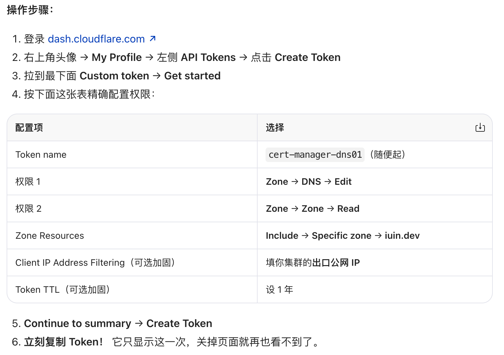

# kasm

## 卸载

```bash
# 卸载 Helm Release
helm uninstall kasm-prod -n kasm-prod
# 删除命名空间（级联删除 Deployment/STS/SVC/Secret/PVC/Job/Certificate）
kubectl delete namespace kasm-prod --wait=true
# 如果卡住，强制清终态：
# kubectl get namespace kasm-prod -o json | jq '.spec.finalizers=[]' | kubectl replace --raw "/api/v1/namespaces/kasm-prod/finalize" -f -
# 清理 local-path 存储残留（关键！Kasm 的 retentionPolicy=Retain 会让 PV 残留）
# 3.1 删除残留 PV（Released/Failed 状态）
kubectl get pv | grep kasm-prod
kubectl delete pv $(kubectl get pv | grep kasm-prod | awk '{print $1}') 2>/dev/null

# 3.2 在每个 K8s 节点上清理物理目录
sudo rm -rf /opt/local-path-provisioner/*kasm-prod*
# 清理集群级证书残留（仅当使用过 cert-manager 自动证书时）
# ClusterIssuer 是集群级资源，不随命名空间删除
kubectl delete clusterissuer letsencrypt-dns-prod 2>/dev/null
# ACME 账户私钥（位于 cert-manager 命名空间）
kubectl delete secret letsencrypt-dns-prod-key -n cert-manager 2>/dev/null
# 清理测试残留 Pod（如果之前调试留下）
kubectl delete pod pg-test kasm-init rdptest -n kasm-prod --force --grace-period=0 2>/dev/null
```

## 安装

```bash
# 调整 K8s 节点内核参数（防崩溃，必做！）
# 临时生效
sudo sysctl -w fs.inotify.max_user_watches=1048576
sudo sysctl -w fs.inotify.max_user_instances=1024

# 永久固化（防止重启失效）
cat <<EOF | sudo tee /etc/sysctl.d/99-kasm-inotify.conf
fs.inotify.max_user_watches=1048576
fs.inotify.max_user_instances=1024
EOF
sudo sysctl --system

# 安装 local-path 存储并设为默认（防 guac 组件 Pending）
# 1.1 安装 local-path（已有则跳过）
kubectl apply -f https://raw.githubusercontent.com/rancher/local-path-provisioner/v0.0.31/deploy/local-path-storage.yaml
# 1.2 设为默认 StorageClass（关键！guac 组件的 PVC 不带 SC 名，必须有默认类）
kubectl patch storageclass local-path -p '{"metadata":{"annotations":{"storageclass.kubernetes.io/is-default-class":"true"}}}'
# 1.3 验证：local-path 后出现 (default)，provisioner 为 Running
kubectl get sc
kubectl get pods -n local-path-storage

# Ingress 开启 hostNetwork（防 NodePort 丢端口导致 VNC 断连）
# 1. 确认节点 80/443 空闲
sudo ss -tlnp | grep -E ':80 |:443 '
# 2. 缩容到 1 副本（防同节点抢端口）
kubectl scale deploy ingress-nginx-controller-nginx -n ingress-nginx --replicas=1
# 3. 开启 hostNetwork
kubectl patch deploy ingress-nginx-controller-nginx -n ingress-nginx --type=json -p='[
  {"op":"add","path":"/spec/template/spec/hostNetwork","value":true},
  {"op":"add","path":"/spec/template/spec/dnsPolicy","value":"ClusterFirstWithHostNet"}
]'
# 4. 验收：容器 IP == 节点 IP，且 443 在监听
kubectl get pods -n ingress-nginx -o wide
sudo ss -tlnp | grep ':443 '

# 证书（Let's Encrypt DNS-01，防 .dev HSTS 锁死 + 防 HTTP-01 内网不可达）
# cert-manager 全自动（推荐，DNS 商支持 API 时）
# 3A.1 安装 cert-manager（已有则跳过）
kubectl apply -f https://github.com/cert-manager/cert-manager/releases/download/v1.16.3/cert-manager.yaml
# 3A.2 创建 DNS API Token Secret（以 Cloudflare 为例，其他厂商换对应 webhook）
kubectl create secret generic cloudflare-api-token --from-literal=api-token=<你的TOKEN> -n cert-manager
# 3A.3 创建 DNS-01 ClusterIssuer(可重复执行, 重复执行则覆盖)
cat <<EOF | kubectl apply -f -
apiVersion: cert-manager.io/v1
kind: ClusterIssuer
metadata:
  name: letsencrypt-dns-prod
spec:
  acme:
    server: https://acme-v02.api.letsencrypt.org/directory
    # 【修改点 1】：改为你的真实邮箱，用于接收 LE 的到期告警
    email: admin@iuin.dev
    privateKeySecretRef:
      name: letsencrypt-dns-prod-key
    solvers:
      - dns01:
          cloudflare:
            # 【修改点 2】：因为我们使用了 apiTokenSecretRef，这个 email 字段其实可以直接删掉。
            # 如果保留，填你登录 Cloudflare 控制台用的那个真实邮箱即可。
            # email: your_cloudflare_login@email.com
            apiTokenSecretRef:
              name: cloudflare-api-token
              key: api-token
EOF
# 验证是否生效(确认你的 ClusterIssuer 状态是 Ready)
kubectl describe clusterissuer letsencrypt-dns-prod
# certbot 手动（任何 DNS 商通用，90 天手动续期）(跳过)

# 安装 Kasm
# 4.1 准备 Helm 仓库
helm repo add kasmweb https://helm.kasm.com 2>/dev/null; helm repo update
# 4.2 确保命名空间存在（选项 A 需要手动建）
kubectl create namespace kasm-prod 2>/dev/null

# 编写 values-prod.yaml（Schema 校验通过版，二选一证书块）：

# 执行安装：
helm install kasm-prod kasmweb/kasm-helm -n kasm-prod -f values-prod.yaml --wait --timeout 15m

# 验收与加固
# 5.1 全部 Running / Completed（选项 A 时 Certificate 为 Ready）
kubectl get pods -n kasm-prod
kubectl get certificate -n kasm-prod
# 5.2 提取管理员密码
kubectl get secret -n kasm-prod kasm-prod-secrets -o jsonpath="{.data.admin-password}" | base64 -d; echo
# 5.3 灾备核心 Secret（丢了这个等于丢整个控制面）
kubectl get secret kasm-prod-secrets -n kasm-prod -o yaml > kasm-prod-secrets-backup.yaml

# 内网缩容（防资源不足 Pending）
# 内网缩容到 1 副本（资源不够时必做）
kubectl scale deploy kasm-prod-api-default -n kasm-prod --replicas=1
kubectl scale deploy kasm-prod-proxy-default -n kasm-prod --replicas=1
kubectl scale deploy kasm-prod-manager-default -n kasm-prod --replicas=1
kubectl scale statefulset kasm-prod-guac-default -n kasm-prod --replicas=1

# 客户端访问：
# 客户端 hosts 添加 10.0.5.167 pdd.iuin.dev（或内网 DNS 做 Split 解析）。
# 浏览器访问 https://pdd.iuin.dev → 绿色小锁头（LE 生产证书，无需 thisisunsafe）。
# 登录 admin@kasm.local + 提取的密码。
# Admin → Settings → Server → 关闭 WebRTC（内网防黑屏必做）→ Save。
# 启动 Workspace，VNC 桌面丝滑弹出。

```

### 获取 Cloudflare API Token（最小权限版）



验证 Token 是否有效（在任意能上网的机器上）：

```bash
curl -s -H "Authorization: Bearer <你的Token>" \
  https://api.cloudflare.com/client/v4/user/tokens/verify
# 官方提供的测试方式
curl "https://api.cloudflare.com/client/v4/user/tokens/verify" \
-H "Authorization: Bearer <你的Token>"
```

这个 Token 泄露了，攻击者能干什么？
- ✅ 能：增删改 iuin.dev 这一个域名的 DNS 记录（比如把 pdd.iuin.dev 指到他的服务器做劫持）。
- ❌ 不能：碰你账号里的其他域名、不能改账号设置、不能看账单、不能动 Workers/Pages 等任何其他服务。

## 关于生产域名解析到内网IP上的问题

如果继续用 HTTP-01，问题原封不动，还是会卡死。 因为“内网 IP”这个事实没有变。
但是！现在我们有了一个新武器——DNS-01 验证（就是上一步 certbot 手动用的那种）。只要把 cert-manager 的 ClusterIssuer 从 HTTP-01 换成 DNS-01，它就完全不需要公网 80 端口，只通过你域名解析商的 API 添加 TXT 记录来验证。这样 cert-manager 就能在内网环境里全自动签发 + 续期 Let's Encrypt 生产证书！

## 排查命令

```bash
kubectl get challenge -n kasm-prod
kubectl get certificate -n kasm-prod
kubectl describe certificate kasm-prod-cert-manager -n kasm-prod
kubectl describe certificaterequest kasm-prod-cert-manager-1 -n kasm-prod
kubectl describe order kasm-prod-cert-manager-1-2168963802 -n kasm-prod
kubectl describe challenge kasm-prod-cert-manager-1-2168963802-2482135258 -n kasm-prod
```

### 更新 Secret 并重置卡死的任务

```bash
# 1. 用新的 Token 覆盖 Secret (把 <你的新Token> 替换掉)
kubectl create secret generic cloudflare-api-token \
  --from-literal=api-token=<你的新Token> \
  -n cert-manager \
  --dry-run=client -o yaml | kubectl apply -f -

# 2. 删掉被限流卡死的 Challenge 和 Order，让 cert-manager 重新排队
kubectl delete challenge kasm-prod-cert-manager-1-2168963802-2482135258 -n kasm-prod
kubectl delete order kasm-prod-cert-manager-1-2168963802 -n kasm-prod
# 3. 删掉旧的 CertificateRequest 强制刷新
kubectl delete certificaterequest kasm-prod-cert-manager-1 -n kasm-prod
```
