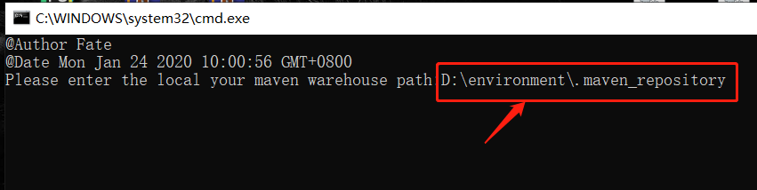

# Maven Usage

## Delete maven repository invalid jar package script

    ```
    delLastUpdated.bat
    ```

Copy the above file using method：
and double click on, enter the address of the Mavenn repository or drag the repository folder into the command window.


## Maven -pluses

- [参考文章](https://blog.csdn.net/zmm0420/article/details/115937027)
- [参考文章](https://blog.csdn.net/wangooo/article/details/109361708)

```shell

crean ploy -Dmaven.test.skip=true -pl project-a (only one of them is constructed)
 
clean - Dmaven.test. kip=true -pl project-a, project-b,project-c (only three of them constructed)

# Example
mvn clean package - Dmaven.test.skip=true -pl cn.facoder:mall-server -am
```

## Dependency Analysis

- mvn dependency:analyze
- Can analyze which dependencies are not available

## jar package wasting

- [参考文章](https://www.cnblogs.com/ygjlch/p/7767639.html) `Primary thinking：will place dependency on host, load dependencies by mounting`
