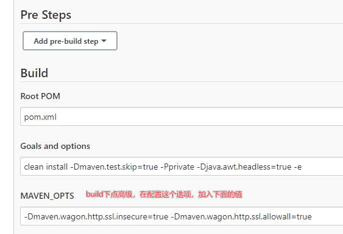

# Logging issues related to jenkins employment

## The jenkins instance looks like to have been offline

    ````
    ``
    Installation of the plugin page is a reminder of the page you offline and don't move.
    Then open a new tab, enter the URL `http://192.168.211.103:8080/jenkins/pluginManager/advanced`. 
    Here is the bottom of a [upgrade site] and replace the link with https, http://updates.jenkins.io/update-center.json. 
    Then close jenkins in the service list, then tomcat reboots so that you can connect to
    ```
    ````

## Enable to download magic plugins

- Could not transfer fact org.apache.maven.plugins:maven-clean-plugin: pom:2.5 from solutions to such problems
- -Dmaven.wagon.http.ssl.insecurity=true -Dmaven.wagon. http.ssl.allow=true # add this configuration to maven_ops.
- -Dmaven.wagon.http.ssl.insecurity=true - Dmaven.wagon. http://www.ssl.allow=true - Dmaven.wagon. http.ssl.ignee.validity.data=true not used
- [参考文章](https://www.cnblogs.com/JavaArchitect/p/14383061.html)



---

## vue items, refresh pages to show 404 issues

- try_files $uri $uri/ /index.html; # 用于解决刷新页面后，显示404的问题
- [参考文章](https://www.cnblogs.com/caijinghong/p/14693820.html)

## npm mirror source problem

- [淘宝镜像源](https://registry.npmmirror.com/)
- [淘宝cnpm镜像源](https://registry.npm.taobao.org)
- [参考文章](https://cloud.tencent.com/developer/article/1372949)

## Apps content to server configuration file by Dockerfile

    `````
    ````
    ``shell
    
    echo "FROM tomcat:8. " > Dockerfile
    echo "MAINER Fa" >> Dockerfile
    echo "RUN rm -rf /usr/local/tomcat/webapps/*" >> Dockerfile
    echo "RUN echo '>> conf/catalina. roperties" >> Dockerfile
    echo "RUN echo 'tomcat.util.http.parser.HttpParser.requestTargetAllow=|{}' >> conf/catalina.properties" >> Dockerfile
    echo "RUN echo 'org. pache.tomcat.util.buf.UDecoder.ALLOW_ENCODED_SLASH=true' >> conf/catalina.properties" >> Dockerfile
    echo "ADD ./target/*. ar /usr/local/tomcat/webapps/" >> Dockerfile
    echo "EXPOSE 80" >> Dockerfile
    # echo 'ENTRYPOINT ["/usr/local/tomcat/bin/cata. h", "run"]" >> Dockerfile
    
    docker build -t docker-test.
    
    ````
    ````
    `````

## Java Related Issues

- Exceptions：org.springframe.web.util.NestedServletException: Handler dispatch failed; nested exception is java.lang.NoClassDefence. Could not initiate class sun.font.SunFontManager
  - Add a parameter to start java: -Djava.awt.headless=true
  - [参考文章](https://www.cnblogs.com/yanqin/p/7160889.html)

- 异常：找不到文件/opt/java/openjdk/lib/libfontmanager.so
  - The file could not be found in the docker image 11-jre-alline, so remove --alpine, use 11-jref
