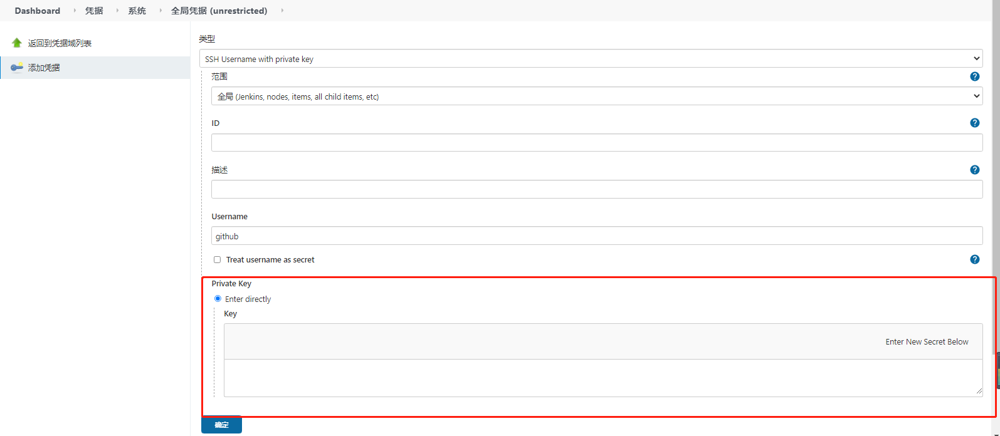

# git fets code by sshl

- Generate Public Private Key

```shell
ssh-keygen -t rsa -C 123456@qq.com”
```

- Configure Public Key (id_rsa.pub) to github.

- Set global credentials in jenkins, select "SSH Username with private key", copy the contents of the id_rsa file to the private key, others are not required here. There we fill in github.


