## Access address

```shell
http://ip:9100/metrics(View indicators)
http://ip:8899/metrics(View docker container indicators)
http://ip:900/(prometheus's original web-ui)
http://ip:3000/(Grafana Open Source Monitoring Component Page)
```


## Grafana Configuration Monitor

- Try it out, default admin user credentials are admin/admin.
- configuration -> base sources -> prometheus
  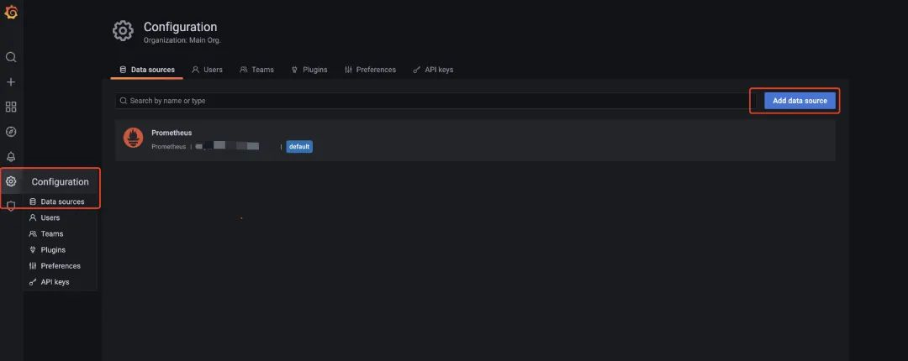
- Configure url: http://prometheus:9090
  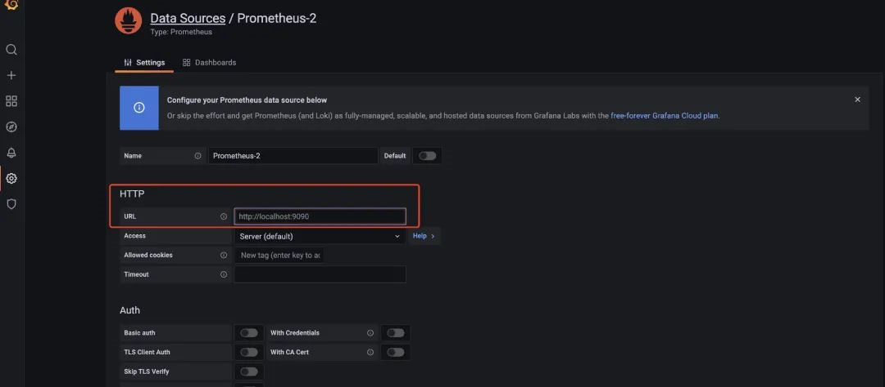
- The relevant template is available at https://grafana.com/grafana/dashboards/.
- create -> import -> 8913
  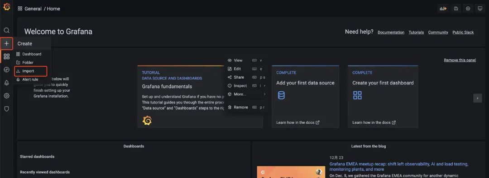
  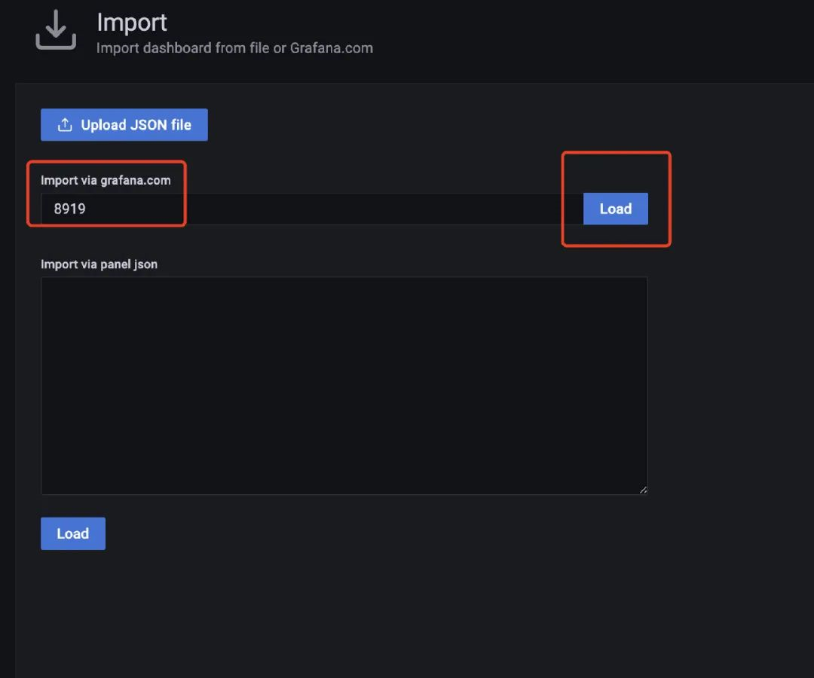
  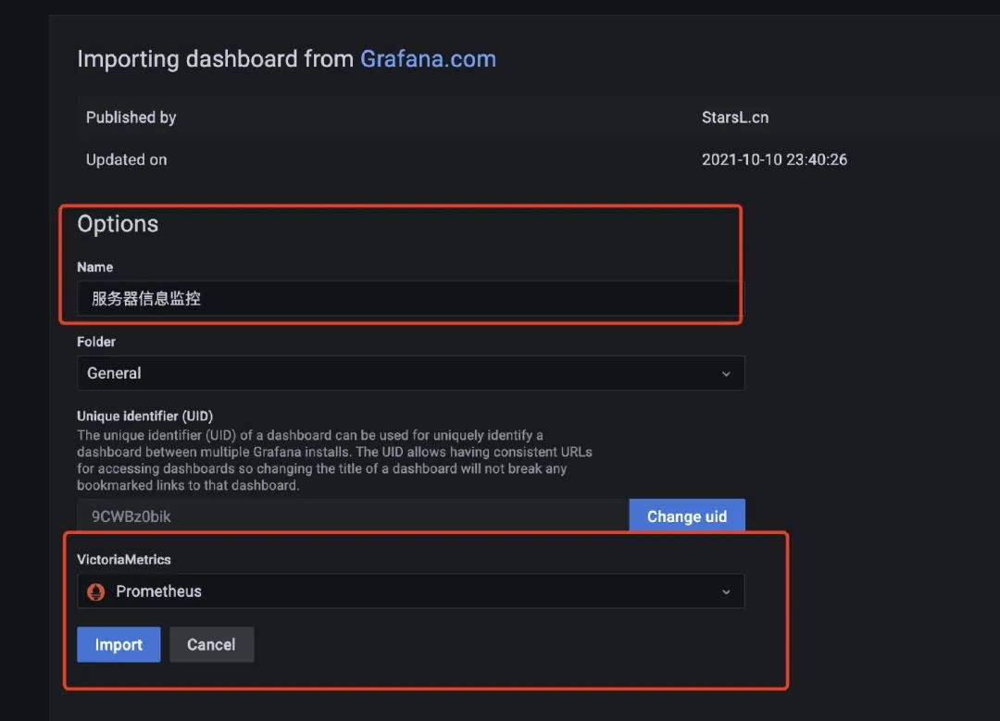
- The service we started with docker is still more saving, and you can see the Docker’s monitoring (the cadvisor service started above collecting the dock's information). We use template 893 to configure the monitoring docker's message：
  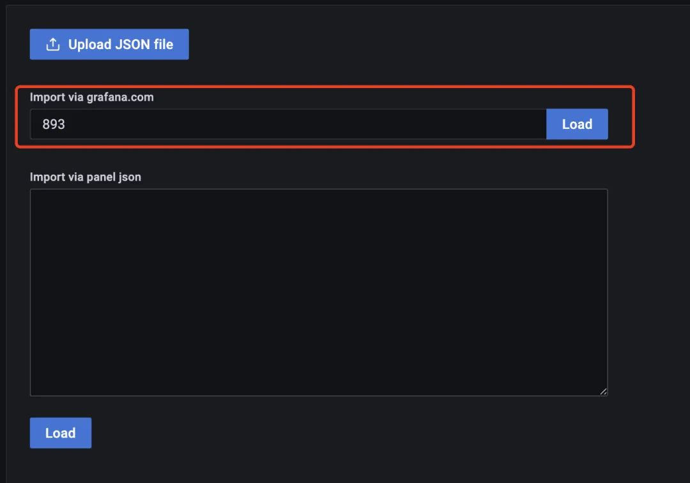

## Java system indicators

- Add two more agencies to the project

```xml
<!--Monitor ->
<dependency>
  <groupId>org. pringframe Boot</groupId>
  <artifactId>spring-boot-starter-actuator</artifactId>
</dependency>
<! - Prometheus-->
<dependency>
  <groupId>io. icrometer</groupId>
  <artifactId>micrometer-registry-prometheus</artifactId>
</dependency>
```

- This add the corresponding configuration to the configuration file (enable monitoring and allow prometheus to fetch)

```yaml
# Monitoring configuration TODO
management:
  endpoint:
    health:
      show-details: always
    metrics:
      enabled: true
    prometheus:
      enable: true
  endpoints:
    web:
      exposre:
        include: '*'
  metrics:
    export:
      prometheus:
        enable: true :
```

- When you start the service, you can see a host of output indicators, including prometheus
  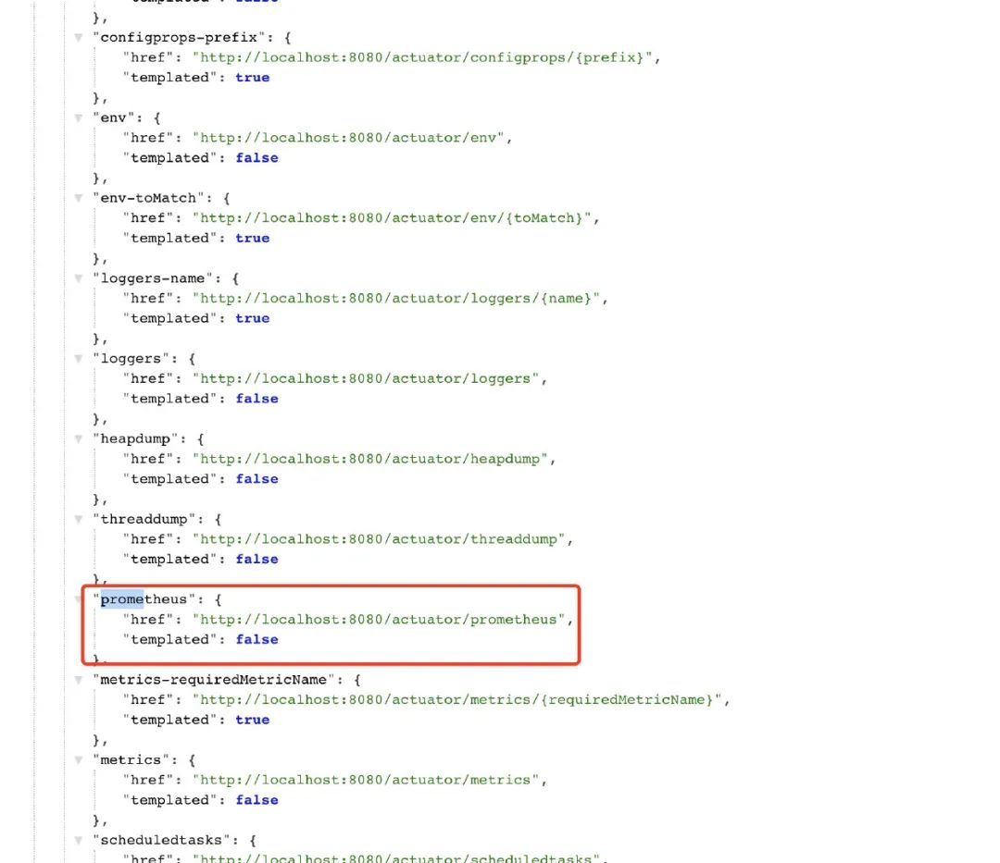
- Adds relevant configuration information： to the previous prometheus.yml file

```yaml
  - job_name: 'austin'
    metrics_path: '/actuator/prometheus' # Collected Path
    static_configs:
    - targets: ['ip:port'] # todo here and port write their own app
```

- Visit the：ip:90/targets path to see what endpoints are now available to prometheus and how they are configured up to date.
  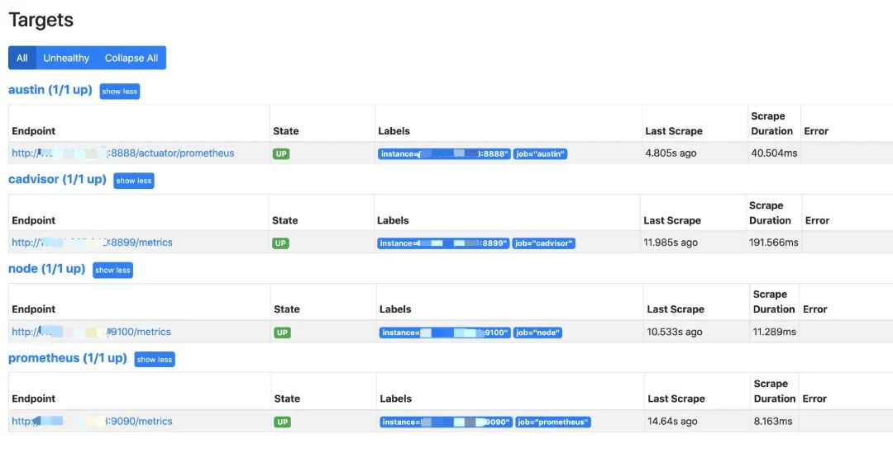
- JVM monitoring and 12900 SpringBoot monitor
  selected for 4701 template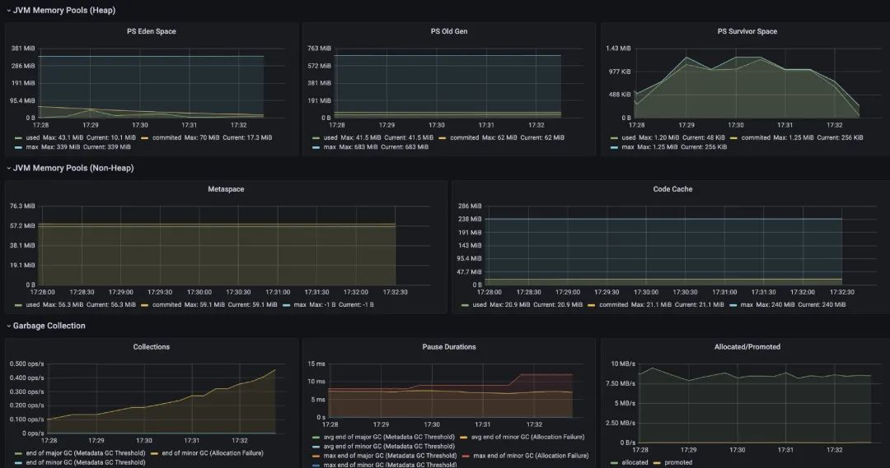
  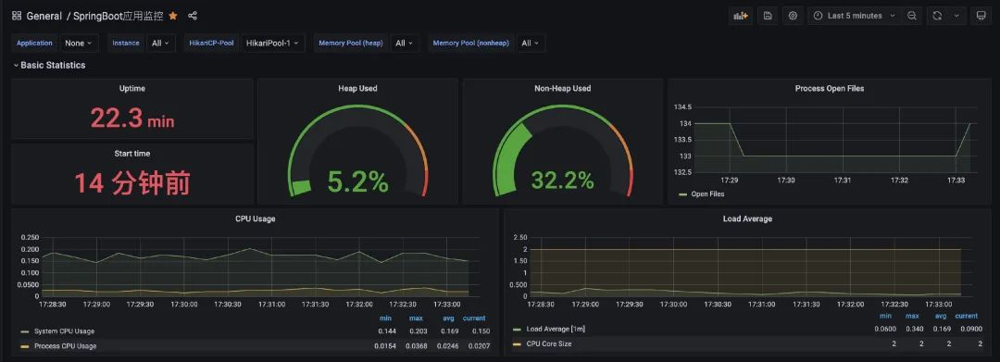
- Business Indicator
  
- Summary of
  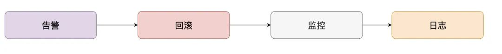
